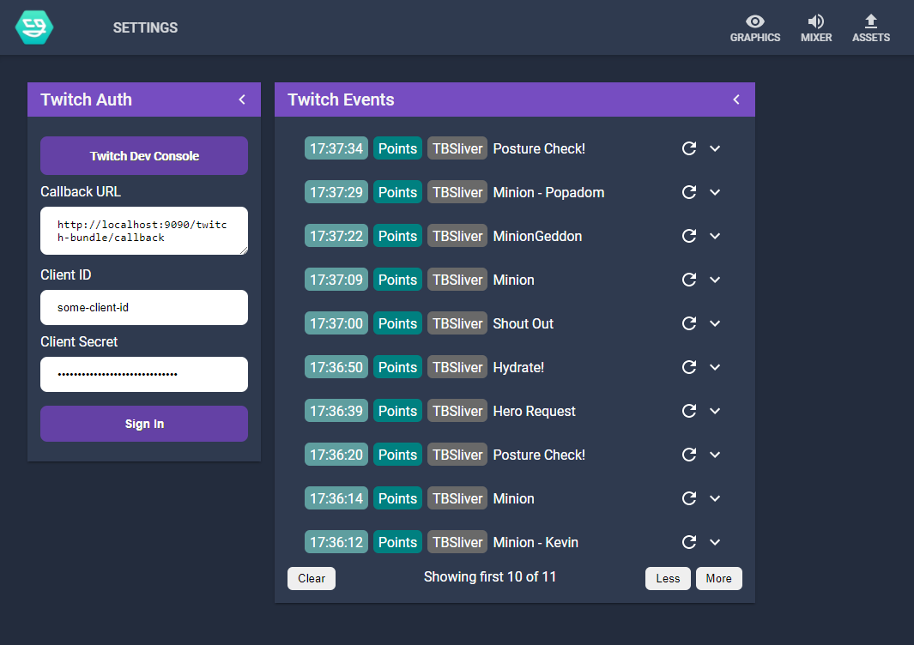

# NodeCG Twitch Bundle

[](https://tbsliver.me/discord)
[](https://twitter.com/TBSliver)
[](https://patreon.com/tbsliver)



This is a bundle for [NodeCG](https://nodecg.dev). This bundle provides a direct integration with the Twitch API,
specifically the following:

* PubSub API
  * Subscription Event
  * Bits Event
  * Bits Badge Event
  * Channel Point Redemption

To use this bundle, install NodeCG as per the usual instructions, then:

```shell
cd bundles
git clone https://github.com/TBSliver/twitch-bundle.git
cd twitch-bundle
npm install
npm run build
```

This adds a new Settings workspace. you will need to have a Twitch Dev Application set up with the correct callback url
- this is displayed in the Twitch Auth panel, with form inputs for the Client ID and Secret.

## Messages

The following messages are available:

* `bits`
* `subscription`
* `redemption`
* `bitsBadgeUnlock`

The data received by this is identical to that returned by Twitch - see
the [PubSub Documentation](https://dev.twitch.tv/docs/pubsub#receiving-messages) for more information. You will also
need to specify the bundle name to receive the messages as well.

Example:

```js
nodecg.listenFor('redemption', 'twitch-bundle', message => {
  console.log(`${message.redemption.user.display_name} redeemed ${message.redemption.reward.title}`);
});
```

# Issues

If you find any issues with this, please open an issue! or ask in my [Discord](https://tbsliver.me/discord), or the [Official NodeCG Discord](https://discord.com/invite/GJ4r8a8) for general issues and development help!

# Contributors

Tom "TBSliver" Bloor
